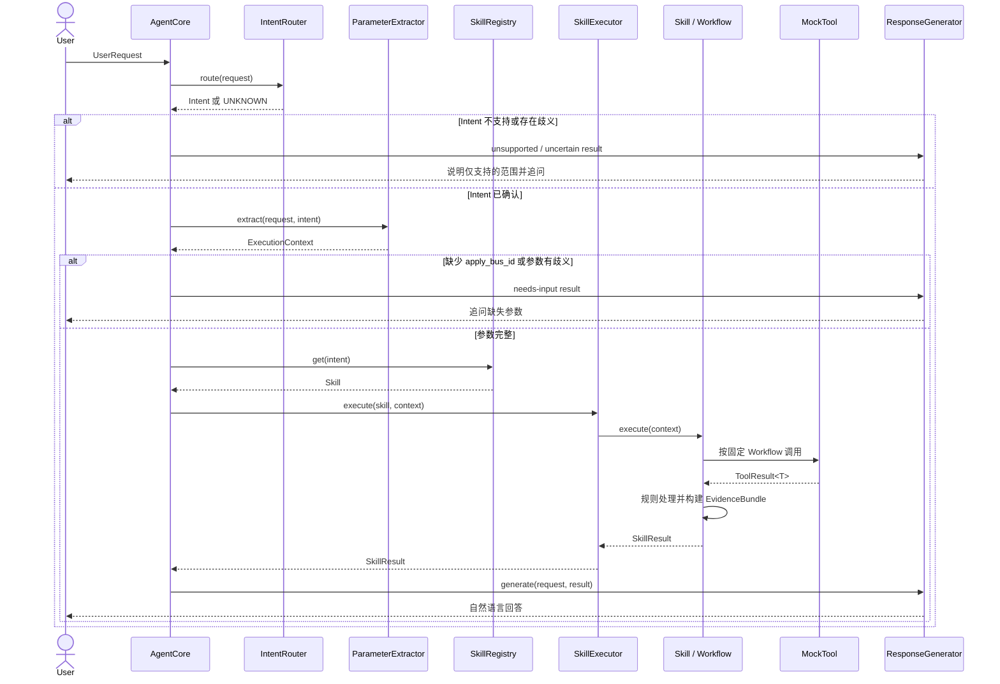

# Agent Core MVP-0 技术设计

- 阶段：Sprint 1 / Agent Core MVP-0
- 状态：Draft for Review
- 结论属性：Design Hypothesis，尚未经过代码或实验验证
- 实现状态：未开始

本文定义 DirectBus Agent Core 的最小技术设计，只服务两个 Intent 和两个 Skill，目标是让 Rory 能够沿着一条显式调用链理解 Intent、参数、Skill、Tool、证据和回答之间的职责边界。

## 1. 目标与范围

MVP-0 固定调用链：

`UserRequest → IntentRouter → ParameterExtractor → SkillRegistry → SkillExecutor → MockTool → EvidenceBundle → ResponseGenerator`

仅支持：

- `PIPELINE_STATUS_QUERY`
- `BUILD_FAILURE_DIAGNOSE`
- Pipeline Status Summary Skill
- Build Failure Analysis Skill

MVP-0 只形成可 Review 的技术设计，不生成完整业务代码，不接 MCP、RAG 或生产系统，不引入 Spring Boot、Spring AI、Ragent、LangChain4j 或其他 Agent 框架。

## 2. 设计选择与取舍

### 2.1 为什么采用 Java 风格、框架无关

- 使用 Rory 熟悉的接口、枚举、POJO / Record 和包结构，降低理解 Agent Core 的语言成本。
- 显式展示对象创建、路由、依赖调用和结果传递，避免框架注解或隐式运行时隐藏调用链。
- 先验证 Intent、Skill、Tool、Evidence 的职责是否合理，再决定是否映射到具体 Agent 框架。
- 保留 Java 编译期类型约束，使状态、Tool 返回和证据字段比通用 Map 更容易审查。

框架无关不等于建设通用 Agent 框架。本设计不追求适配任意业务、任意 Planner 或任意 Tool，只覆盖当前两个 Intent 和两个 Skill。

### 2.2 与其他方案的取舍

| 方案 | 优点 | 代价 | MVP-0 选择 |
| --- | --- | --- | --- |
| Java 风格、框架无关 | 贴近现有能力；类型和调用链清晰；便于后续纯 Java 实验 | 需要显式编写装配和流程代码 | 采用 |
| 完全语言无关 | 概念抽象，便于跨语言讨论 | 包结构、类型和调用方式仍需二次映射，学习反馈不够具体 | 不采用 |
| Python 方案 | 原型速度快，AI 生态示例多 | 与 Rory 的 Java 工程经验连接较弱，后续仍需迁移 | 不采用 |

### 2.3 后续映射 Spring AI / Ragent 的边界

后续框架只能替换外围适配，不得改变已经验证的业务边界：

- 可以替换模型调用、Tool Adapter、对象装配和可观测性实现。
- 可以把 `Tool` 映射为 Spring AI Tool 或 Ragent Tool。
- 可以把受限模型分类和回答生成映射到框架提供的 Model Client。
- 不得把固定 Workflow 改为模型自由规划。
- 不得让框架绕过 `EvidenceBundle` 直接根据原始 Tool 文本生成事实结论。
- 映射工作只在纯 Java MVP-1 跑通并完成 Review 后评估。

## 3. 总体架构与组件职责

| 组件 | 核心职责 | 输入 | 输出 | 明确边界 |
| --- | --- | --- | --- | --- |
| `UserRequest` | 表达一次用户请求及已确认上下文 | 用户问题、会话上下文 | 不可变请求对象 | 不包含推断后的 Intent 或业务结论 |
| `IntentRouter` | 在两个业务 Intent 中路由 | `UserRequest` | `Intent` | 不选 Tool，不执行 Skill |
| `ParameterExtractor` | 抽取并校验执行所需参数 | `UserRequest`、`Intent` | `ExecutionContext` | 不猜测缺失参数，不调用 Tool |
| `SkillRegistry` | 建立 Intent 到 Skill 的固定映射 | `Intent` | `Skill` | 不做动态发现或模型选择 |
| `SkillExecutor` | 调用选定 Skill 并传递上下文 | `Skill`、`ExecutionContext` | `SkillResult` | 不规划步骤，不改变 Workflow |
| `Skill` | 表达业务能力边界 | `ExecutionContext` | `SkillResult` | 不直接生成无证据结论 |
| `Workflow` | 控制固定 Tool 顺序、规则和证据聚合 | 上下文、类型化 Tool | `EvidenceBundle` | 不允许模型增删或重排步骤 |
| `MockTool` | 用固定样本模拟外部只读查询 | 类型化查询参数 | `ToolResult<T>` | 不做业务判断，不产生副作用 |
| `EvidenceBundle` | 统一保存事实、来源、缺失、冲突和不确定性 | Tool 结果、确定性规则 | 结构化证据 | 不包含模型虚构或未标来源的事实 |
| `ResponseGenerator` | 把 Skill 结果转换为自然语言 | `SkillResult` | 最终回答 | 不修改事实，不补充 Evidence 之外的结论 |

`AgentCore` 作为薄编排入口，负责按固定调用链连接上述组件。它不是 Planner，也不包含 DirectBus 业务规则。

## 4. 核心抽象

### 4.1 Model

| 抽象 | Java 表达 | 最小内容 |
| --- | --- | --- |
| `UserRequest` | Record | `requestId`、`userText`、已确认会话上下文 |
| `Intent` | Enum | `PIPELINE_STATUS_QUERY`、`BUILD_FAILURE_DIAGNOSE`、控制值 `UNKNOWN` |
| `ExecutionContext` | Record | `UserRequest`、`Intent`、已确认参数、缺失参数 |
| `EvidenceBundle` | Record / POJO | 查询范围、证据项、Tool 执行摘要、缺失项、冲突、不确定性 |
| `SkillResult` | Record / POJO | 执行状态、`EvidenceBundle`、回答重点和边界提示 |

`UNKNOWN` 只是无法安全路由时的控制值，不是第三个业务 Intent。

### 4.2 Service Contract

| 抽象 | 概念方法 | 说明 |
| --- | --- | --- |
| `IntentRouter` | `route(UserRequest)` | 只返回受支持 Intent 或 `UNKNOWN` |
| `ParameterExtractor` | `extract(UserRequest, Intent)` | 生成 `ExecutionContext`，保留缺参状态 |
| `Skill` | `supportedIntent()`、`execute(ExecutionContext)` | 一个 Skill 只绑定一个顶层 Intent |
| `SkillRegistry` | `get(Intent)` | 使用显式 Map 建立固定映射 |
| `Tool<I, O>` | `name()`、`execute(I)` | 返回类型化 `ToolResult<O>` |
| `ResponseGenerator` | `generate(UserRequest, SkillResult)` | 只消费结构化结果生成回答 |

`SkillExecutor` 在 MVP-0 中是简单具体类，不额外抽象执行引擎接口。

## 5. 调用时序



关键控制点：缺少必需参数时不进入 `SkillRegistry` 和 `SkillExecutor`；Tool 失败或证据冲突时仍进入 `ResponseGenerator`，但 `SkillResult` 必须标记部分结果或“不确定”。

## 6. Intent Router 方案及取舍

### 6.1 采用确定性优先的受限路由

MVP-0 首选 `RuleBasedIntentRouter`：

| Intent | 高置信触发语义 |
| --- | --- |
| `PIPELINE_STATUS_QUERY` | 当前阶段、整体进度、哪些基线未完成、`isRunning` 与生命周期解释 |
| `BUILD_FAILURE_DIAGNOSE` | 构建失败原因、失败项目 / 基线、已有 AI 分析、重构建历史 |

路由规则：

1. 只在两个枚举值之间匹配。
2. 用户关注“是否结束、当前到哪一步”时优先状态查询。
3. 用户关注“哪里失败、证据是什么、为什么仍是上次失败”时优先构建失败诊断。
4. 无匹配或两个 Intent 同时高置信命中时返回 `UNKNOWN`，不强行选择。

### 6.2 模型辅助边界

后续可以增加受限模型分类器，但输出仍只能是两个 Intent 或 `UNKNOWN`。MVP-1 的首个纯 Java 实验不依赖模型路由，先用规则和 UQ-005～UQ-012 验证职责边界。

| 方案 | 取舍 |
| --- | --- |
| 纯规则 | 可复现、易调试；自然语言覆盖有限，适合作为 MVP 基线 |
| 模型直接路由 | 表达覆盖广；结果波动且容易越界，不采用 |
| 规则优先 + 受限模型兜底 | 兼顾控制和覆盖；需要额外实验，作为后续候选 |

## 7. 参数抽取方案

两个 Intent 的必需参数都是 `apply_bus_id`；`projectName`、`baselineName` 为可选过滤条件。

抽取优先级：

1. 用户当前问题中的显式值。
2. 会话中唯一且已经用户确认的上下文值。
3. 无唯一值时标记缺失或歧义并追问。

MVP-0 使用确定性抽取：显式格式、精确字符串和已确认上下文。后续模型只能返回候选值，候选必须能追溯到用户文本或已确认上下文，否则不得写入 `ExecutionContext`。

| 情况 | 处理 |
| --- | --- |
| 缺少 `apply_bus_id` | 返回 `NEEDS_INPUT`，不调用 Tool |
| 存在多个候选 ID | 列出歧义并要求用户选择 |
| 项目或基线无法精确匹配 | 不做模糊猜测，要求确认 |
| “我的直通车”无可用上下文 | 不自动查询最近记录，能力保持 TODO |

## 8. Skill 的代码表达方式

MVP-0 使用一个最小 `Skill` 接口和两个显式实现：

| Skill 实现 | 绑定 Intent | 组合的 Workflow |
| --- | --- | --- |
| `PipelineStatusSummarySkill` | `PIPELINE_STATUS_QUERY` | `PipelineStatusSummaryWorkflow` |
| `BuildFailureAnalysisSkill` | `BUILD_FAILURE_DIAGNOSE` | `BuildFailureAnalysisWorkflow` |

设计约束：

- `SkillRegistry` 使用显式 `Map<Intent, Skill>`，不做反射、注解扫描或插件发现。
- Skill 负责能力边界和输入检查，具体固定步骤由对应 Workflow 控制。
- 不使用 YAML / JSON Workflow DSL，不建设通用节点引擎。
- 不把 Markdown Skill 文档直接当作运行时 Prompt；Markdown 是设计依据，Java 类型是执行表达。
- `SkillExecutor` 只调用 Skill 并处理统一异常，不根据模型输出规划 Tool。

## 9. Skill、Workflow 与 Tool 的边界

| 层次 | 负责 | 不负责 |
| --- | --- | --- |
| Skill | Intent 绑定、业务能力边界、输入是否可执行 | 外部数据查询细节、自由规划 |
| Workflow | Tool 顺序、确定性过滤、状态聚合、证据充分性检查 | 自然语言润色、网络协议 |
| Tool | 接收明确查询参数并返回结构化事实 | 判断业务原因、选择下一 Tool、生成最终回答 |
| ResponseGenerator | 基于证据选择表达方式 | 修改 Tool 事实、执行规则或不确定状态 |

Tool 均为只读能力。MVP-0 不包含重构建、重测、豁免、合入等有副作用操作。

### 9.1 MVP Tool 集合

| Skill | 固定 Tool |
| --- | --- |
| Pipeline Status Summary | `query_directbus_status`、`query_build_detail`、`query_test_detail` |
| Build Failure Analysis | `query_directbus_status`、`query_build_detail`、`query_build_failure_analysis` |

`query_build_failure_analysis` 表示消费已有系统生成的分析结果，本地 Agent 不据此宣称独立完成根因分析。`query_minimal_set_config` 和 `query_version_base` 不进入 MVP-0。

## 10. 固定 Workflow 的控制位置

固定 Workflow 位于 `workflow` 包中的两个具体类，不放在 Prompt、Router、Executor 或 Tool 内。

### 10.1 Pipeline Status Summary Workflow

1. 查询 DirectBus 全局状态。
2. 查询构建明细。
3. 查询测试明细。
4. 使用 `isHistory = 0` 过滤当前记录。
5. 按项目、基线聚合状态并检查全局 / 明细冲突。
6. 构建 `EvidenceBundle`。

MVP-0 先串行调用构建和测试明细 Tool，是否并行保留为 DH-001。

### 10.2 Build Failure Analysis Workflow

1. 查询 DirectBus 全局状态。
2. 查询构建明细并区分当前 / 历史记录。
3. 只从 `isHistory = 0` 定位当前失败对象。
4. 针对当前失败对象查询已有分析结果。
5. 交叉核对 `failureStage`、`failureModule`、`errorSummary` 与 `aiAnalysisResult`。
6. 按需还原可确认的重构建轨迹。
7. 构建 `EvidenceBundle`；证据不足时标记“不确定”。

MVP-0 对多个失败对象按稳定顺序逐个处理，不假设 Tool 已支持批量查询；批量能力保留为 DH-003。

## 11. Tool 的结构化返回

`ToolResult<T>` 是 Tool 层统一返回，不把自由文本直接交给 ResponseGenerator。

| 字段 | 含义 |
| --- | --- |
| `toolName` | Tool 的稳定名称 |
| `status` | `SUCCESS`、`PARTIAL` 或 `FAILURE` |
| `data` | 类型化 Payload；失败时可以为空 |
| `errorCode` | Mock 或真实 Adapter 的错误标识，可为空 |
| `errorMessage` | 可展示但不能直接推导业务结论的错误说明 |
| `observedAt` | 本次数据观察时间 |

MVP Payload：

| Payload | 最小字段 |
| --- | --- |
| `DirectBusStatusData` | `applyBusId`、`isRunning`、`buildStageStatus`、`buildNodeStatus` |
| `BuildDetailData` | 项目、基线、构建状态、失败阶段 / 模块、错误摘要、重试 / 重构建次数、时间、`isHistory` |
| `TestDetailData` | 项目、基线、测试状态、领域、失败摘要、时间、`isHistory` |
| `BuildFailureAnalysisData` | 当前失败对象关联信息、`aiAnalysisResult`；真实关联字段 TODO |

MockTool 使用固定 Fixture 根据 `apply_bus_id` 返回确定结果，并能够模拟成功、部分失败、Tool 失败、字段缺失和证据冲突。它不访问网络或 MCP。

## 12. EvidenceBundle 与 SkillResult

### 12.1 EvidenceBundle 字段

| 字段 | 含义 |
| --- | --- |
| `requestId` | 关联一次 Agent Core 调用 |
| `intent` | 已确认 Intent |
| `skillName` | 实际执行的 Skill |
| `queryScope` | `apply_bus_id`、项目和基线范围 |
| `evidenceItems` | 带来源的结构化事实集合 |
| `toolExecutions` | 每个 Tool 的名称、状态和错误摘要 |
| `missingEvidence` | 缺失字段、未返回数据或无法关联的信息 |
| `conflicts` | 全局 / 明细或结构化字段 / 已有分析之间的冲突 |
| `uncertain` | 当前是否无法形成充分结论 |
| `uncertaintyReasons` | 不确定的具体原因 |

每个 Evidence Item 至少记录：事实名称、事实值、来源 Tool、来源字段、项目 / 基线范围、当前或历史标记、观察时间。这样 ResponseGenerator 能说明“结论来自哪里”。

### 12.2 SkillResult

`SkillResult` 包装 `EvidenceBundle`，执行状态只使用：

- `SUCCESS`：Tool 完整且证据一致。
- `NEEDS_INPUT`：缺少必需参数，未进入 Tool 调用。
- `PARTIAL`：部分 Tool 或字段不可用，但仍有可确认事实。
- `UNCERTAIN`：存在关键缺失或冲突，不能给出确定结论。
- `FAILED`：关键 Tool 失败，无法完成该 Skill 的核心目标。

## 13. 模型参与点与禁止事项

### 13.1 允许参与

- 在规则无法唯一分类时，进行受限 Intent 分类候选输出。
- 从用户文本中提出参数候选，但必须通过来源校验。
- 摘要已有 `aiAnalysisResult`，并明确其来源是构建侧已有分析。
- 根据 `EvidenceBundle` 选择解释重点、组织顺序和自然语言。
- 将缺失、冲突和不确定原因表达为清晰追问或说明。

MVP-1 可以先使用模板式 `ResponseGenerator` 跑通纯 Java 闭环，再实验模型版实现；两者必须消费相同的 `SkillResult`。

### 13.2 禁止事项

- 不得选择、增删、跳过或重排固定 Tool 调用。
- 不得修改状态枚举、`isHistory` 过滤或确定性聚合结果。
- 不得生成 `EvidenceBundle` 中不存在的事实、参数、日志或错误码。
- 不得把 Tool 空结果或失败解释为成功。
- 不得把已有 AI 分析当作本地 Agent 的最终根因结论。
- 不得判断或执行重构建、重测、豁免、合入。
- 不得引入自由规划、多 Agent 协作或长期记忆。

## 14. 不确定结果处理

不确定性由 Workflow / Skill 确定，ResponseGenerator 只能解释，不能消除。

| 场景 | SkillResult | 输出要求 |
| --- | --- | --- |
| 缺少 `apply_bus_id` | `NEEDS_INPUT` | 追问参数，不调用 Tool |
| Intent 无法唯一识别 | 不进入 Skill | 说明支持范围并要求澄清 |
| 非关键 Tool 部分失败 | `PARTIAL` | 只陈述已确认事实，列出缺失部分 |
| 关键证据缺失或互相冲突 | `UNCERTAIN` | 必须出现“不确定”，说明原因和缺失信息 |
| 关键 Tool 失败 | `FAILED` | 说明无法完成查询，不猜测业务结果 |
| 完整查询确认没有当前失败记录 | `SUCCESS` | 明确“未发现当前失败”，不得用历史失败替代 |
| 缺少已有 AI 分析 | `UNCERTAIN` 或 `PARTIAL` | 可定位失败项，但根因必须标记“不确定” |

所有“不确定”回答必须包含：已确认事实、缺失或冲突证据、受影响结论，以及需要用户补充或人工核对的内容。人工入口未知时保留 TODO。

## 15. MVP 包结构

以下是后续纯 Java MVP-1 的建议结构，本轮不创建这些源码文件：

```text
com.projectphoenix.agentcore
├── AgentCore.java
├── model
│   ├── UserRequest.java
│   ├── Intent.java
│   ├── ExecutionContext.java
│   ├── EvidenceBundle.java
│   └── SkillResult.java
├── router
│   ├── IntentRouter.java
│   └── RuleBasedIntentRouter.java
├── extractor
│   ├── ParameterExtractor.java
│   └── RuleBasedParameterExtractor.java
├── skill
│   ├── Skill.java
│   ├── SkillRegistry.java
│   ├── SkillExecutor.java
│   ├── PipelineStatusSummarySkill.java
│   └── BuildFailureAnalysisSkill.java
├── workflow
│   ├── PipelineStatusSummaryWorkflow.java
│   └── BuildFailureAnalysisWorkflow.java
├── tool
│   ├── Tool.java
│   ├── ToolResult.java
│   ├── ToolName.java
│   ├── payload
│   │   ├── DirectBusStatusData.java
│   │   ├── BuildDetailData.java
│   │   ├── TestDetailData.java
│   │   └── BuildFailureAnalysisData.java
│   └── mock
│       ├── MockDirectBusStatusTool.java
│       ├── MockBuildDetailTool.java
│       ├── MockTestDetailTool.java
│       └── MockBuildFailureAnalysisTool.java
└── response
    ├── ResponseGenerator.java
    └── TemplateResponseGenerator.java
```

暂不增加 `planner`、`memory`、`mcp`、`rag`、`agent-framework`、插件发现或通用 Workflow Engine 包。

## 16. 避免过度设计的约束

- 业务 Intent 只有两个；`UNKNOWN` 仅用于安全兜底。
- Skill 只有两个，使用显式 Registry，不做动态扩展机制。
- 每个 Skill 只有一个具体 Workflow，不抽象 DAG、节点 DSL 或状态机引擎。
- Tool 使用类型化接口和 Mock 实现，不建设通用 RPC / MCP Adapter 层。
- MVP-0 / MVP-1 默认串行执行，不先做并发、异步、重试框架或缓存。
- EvidenceBundle 只保留回答与追溯所需字段，不设计企业级审计模型。
- ResponseGenerator 先允许模板实现，不为了“像 Agent”而提前依赖模型框架。
- 不实现第三个 Skill、完整 MCP、RAG、Evaluation、权限和生产工程化。

## 17. 后续 Design Hypotheses

以下内容需要通过 MVP-1 代码或实验验证，当前不能作为已验证结论：

| 编号 | Design Hypothesis | 最小验证方向 |
| --- | --- | --- |
| DH-001 | `query_build_detail` 与 `query_test_detail` 是否可并行调用 | 比较串行与并行对顺序、错误处理和收益的影响 |
| DH-002 | 状态枚举、`isHistory` 过滤应归为确定性规则，而非 RAG Knowledge | 用规则实现验证可测试性和变更成本 |
| DH-003 | `query_build_failure_analysis` 是否需要支持多个失败对象批量查询 | 比较逐个查询与批量查询的接口复杂度 |
| DH-004 | `errorSummary` 与 `aiAnalysisResult` 的证据等级和冲突处理规则 | 构造一致、冲突、缺失三类 Fixture |
| DH-005 | 已有分析结果不存在时，MVP 的降级路径 | 验证只返回结构化失败字段是否足够有用 |
| DH-006 | 规则优先 Router 能否稳定覆盖两个 Intent | 使用 UQ-005～UQ-012 和歧义问题验证 |
| DH-007 | 确定性 ParameterExtractor 能否覆盖 MVP 必需参数 | 验证显式 ID、上下文 ID、缺失和多候选场景 |
| DH-008 | EvidenceBundle 字段能否支持回答可追溯和不确定说明 | 从最终回答反查每个事实来源 |
| DH-009 | 模板式 ResponseGenerator 是否足以跑通首个学习闭环 | 比较模板输出与受限模型输出的可理解性 |
| DH-010 | 有副作用的 Retry Skill 应如何划分 Skill 预检查与高阶 MCP Tool / 后端强校验 | 对比高阶 Tool 封装模式与 Skill 预检查模式，验证安全边界和用户确认位置 |
| DH-011 | 不同 Skill 应具有各自的证据类型、业务不变量、冲突规则和降级策略 | 至少完成状态汇总和构建失败分析两个 Skill 后，再评估公共 Evidence Rule 接口 |
| DH-012 | Pipeline Status Summary 中 Build / Test 明细的证据等级可能不是固定的 | 对比不同全局阶段、用户询问范围和当前业务节点下的证据必要性 |

### 17.1 DH-010：Retry Skill 的高阶 Tool 封装与安全边界

公司内部 Retry Skill 当前采用高阶 MCP Tool 封装模式。

Skill 负责：

- 意图识别。
- 参数收集。
- 调用高阶 MCP Tool。
- 结果解释。

MCP Tool / 后端负责：

- 重试资格校验。
- 权限校验。
- 幂等校验。
- 状态二次确认。
- 最终重试执行。

这种模式不代表不存在 Workflow，而是 Workflow 和业务规则主要下沉在 MCP Tool / 后端，Agent 侧只保留较薄的调用流程。

后续本地实践应对比以下两种模式：

1. 高阶 Tool 封装校验与执行。
2. Skill 预检查 + 用户确认 + Tool 最终强校验。

本假设需要重点验证：

- Skill 预检查能否改善用户体验、解释性和提前失败提示。
- 用户确认应位于哪些检查之后、最终执行之前。
- Skill 与 Tool / 后端出现校验结果不一致时如何处理。
- 高阶 Tool 封装是否会隐藏过多流程，影响 Agent 侧可观测性和错误解释。
- 两种模式对重复调用、状态变化和并发操作的处理差异。

无论采用哪种模式，有副作用操作的最终业务安全规则都必须保留在 Tool / 后端，不能只依赖模型或 Skill 层判断。Skill 侧预检查只能用于体验优化和提前反馈，不能替代服务端最终强校验。

### 17.2 DH-011：Skill 专属证据规则与公共执行治理边界

不同 Skill 具有不同的证据类型、业务不变量、冲突规则、降级策略、前置条件和确认规则。

公共执行层只处理 Tool 调用、超时、异常、Trace 和审计等技术治理。具体证据完整性、冲突判断和业务结果状态，应由各 Skill 的 Workflow 或 Skill 专属 Evidence Policy 负责。

至少完成 Pipeline Status Summary 与 Build Failure Analysis 两个 Skill 后，再根据实际重复模式判断是否需要抽象公共 Evidence Rule 接口。当前不引入通用规则引擎或统一业务规则接口。

### 17.3 DH-012：Pipeline Status Summary 的动态证据等级

在 Pipeline Status Summary Skill 中，Build / Test 明细的证据等级可能不是固定的，其重要性可能取决于：

- 当前全局阶段。
- 用户具体询问范围。
- 当前正在执行的业务节点。

例如，当当前阶段为 `BUILD` 时，`query_build_detail` 可能属于关键证据，`query_test_detail` 可能是非必要证据。

当前只实现并验证一个最小动态规则：当全局阶段为 `BUILD` 时，Build 明细属于关键证据，缺失时返回 `UNCERTAIN`。用户询问范围、其他全局阶段和当前业务节点对证据等级的影响仍未验证，因此 `DH-012` 保持未完全验证状态。

## 18. Review Gate

进入 MVP-1 实现前需要确认：

- 组件职责是否清晰且没有重复承担业务判断。
- 固定 Workflow 是否位于正确层次。
- ToolResult、EvidenceBundle、SkillResult 三层数据是否足够且不过度。
- “不确定”是否能从 Tool 异常和证据冲突稳定传递到最终回答。
- Java 包结构是否帮助理解调用链，而不是形成新的通用框架。

本设计 Review 通过前不生成完整代码，不开始第三个 Skill，也不接入 Spring AI、Ragent、MCP、RAG 或 Evaluation。
