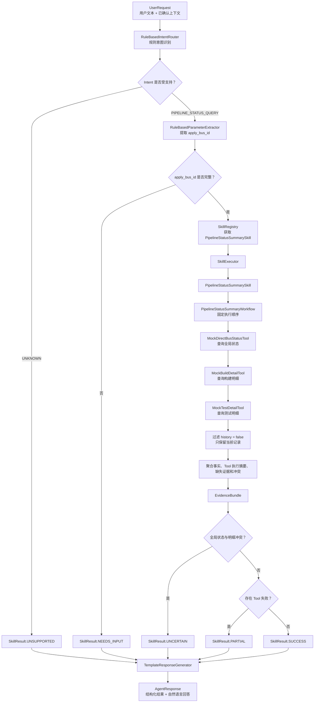

# Pipeline Status Summary MVP-1.1

纯 Java、框架无关的单 Skill 最小闭环。只使用固定 Fixture，不访问网络、MCP、LLM 或公司接口。

## 代码流程图



读图重点：

- `UNKNOWN` 和缺少 `apply_bus_id` 都在进入 `SkillRegistry` 前返回，不会调用任何 Tool。
- Workflow 串行调用三个 Mock Tool，并以 `history = false` 作为当前记录过滤规则。
- 最终回答只能消费 `SkillResult` 中的 `EvidenceBundle`，不能绕过证据补充事实。

## 运行测试

需要 JDK 17 或更高版本：

```bash
./run-tests.sh
```

测试脚本将源码编译到临时目录，不在仓库内生成构建产物。
